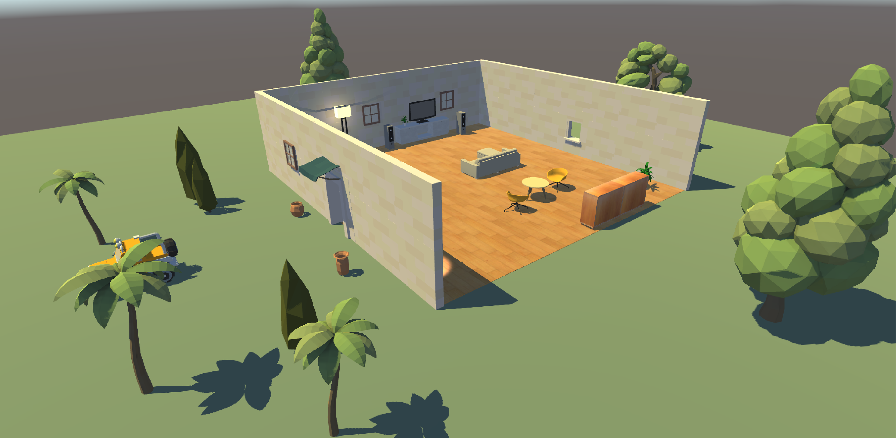

# Welcome Everyone! #

This is JL's project from CSE 490J. Thanks for viewing my dummy house and dummy character!

I recommend you to use Unity with version **above 2018.2.10f1**, because I developed it using 2018.2.11f1.
The default scene is called SampleScene.Unity. 

I created several folders with difference hierachies. You can see that I divided the folders into terrains,
furnitures, electronic devices, etc. I imported multiple assets that might not be used. I have a timeline 
controlling the character's moonwalk and a default camera movement.

I downloaded the cinemachine package from the Window/Package Manager menu. And I downloaded the free male 
model from Assets Store. The free male is qute but has some bugs that it cannot walk along the floor. So
I made it walk on the same position by using the timeline function. 

## Tips to notice when editing:

* You can click on the character to access the timeline and see there is a walk animation. 

* Click on the play button to see my camera movement. The camera playing the scene should be called CharaCamera under the folder of Cameras. Then click on the animation menu below next to the timeline to see my key frame settings.

* The walls are ensembled by multiple small pieces since I found the texture of the wall could not be tiled with other sizes to fit the one whole wall. So I separate them into pieces.

I didn't finish the very good idle and walking movement. So I uploaded the simple actions. Please forgive me. Thanks for the help from the two TAs.

I am happy to help you waste 17 seconds and see the famous moonwalk!

Here are some screenshots of my project!

### Credits to: ###
### From poly.google ###
    * Wizard Tower - Nick Slough https://poly.google.com/view/fFiFJ3hdY06 
    * Jeep - Alex “SAFFY” Safayan https://poly.google.com/view/4gOfX6DR4yG